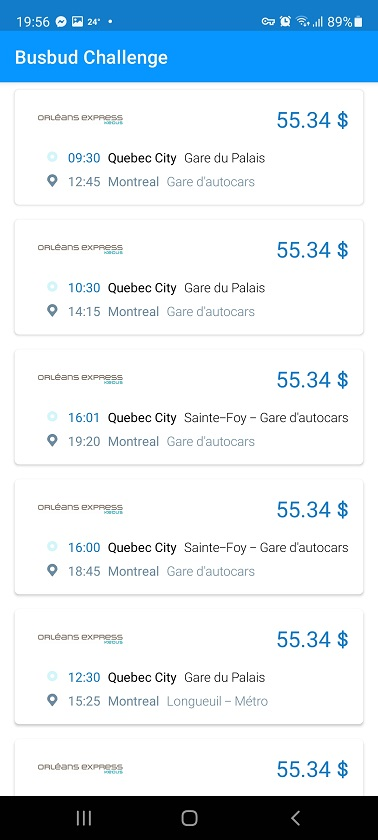
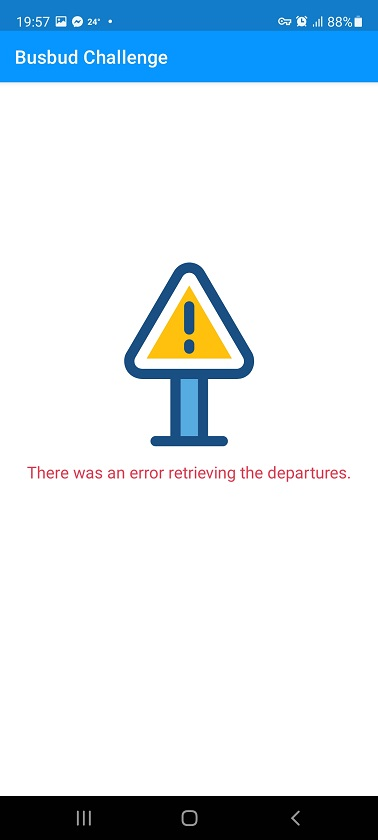

## My solution to the Busbud Challenge

Here are described the project's functionalities, challenges, how it is organized and architectured,limitations and possible future improvements if I had more time.

### Functionalities

When the app launches it shows an Onboarding Screen with a simple button to show the Departures List Screen:


The Departures List Screen starts loading then shows the retrieved departures in a list. If there's any kind of error, it will show an error image and text instead of the list:

 | 

### Challenges

- One of the challenges was to make sense of the network responses, there's a lot of data which is not needed for this challenge and I tried to parse only what's needed.
- Another challenge was to mediate the `search` and `poll` requests but RXJava provided all I need work it out.
- And of course, the challenge to provide a meaningful demonstration of my work in a small amount of time. Still, I could re-use a lot of code from past projects and I ended up spending around 20
  hours coding this.

### Project structure

I avoid having a single module per project. Instead I prefer to organize the code in several modules to enforce decoupled code between the layers of the software. It's also relevant to the fact that
Gradle will parallelize building each module and avoid re-building untouched modules, ending up with a fast build process.

This project structured into the following modules:

- `app` : the project bootstrap module and UI code (presentation layer). Most Android-specific code is here.
- `domain` : code relate to domain logic (business logic layer)
- `api` : network code wiring to the remote busbud api (network layer)
- `common` : code that can be re-used by any other module, such as logging.

All modules are 100% Kotlin code.

### Architecture

The software architecture used here brings some of the concepts from Uncle Bob's _Clean Architecture_. A lot of it is overkill for such a small project but I care a lot about testable and maintainable
software architecture and I wanted it to stand out. I had most of the foundation for this already coded from another project thus it was fast to re-use what I needed :)

**Presentation Layer**

The presentation layer uses the MVVM pattern with the official Google libs such as ViewModel and LiveData.

**Business Logic Layer**

The business logic layer uses the _Repository_ pattern to abstract data access and _UseCases_ (sometimes referred as _Interactors_) to encapsulate the domain logic.

These _Repositories_ expose RX-oriented interfaces and the _UseCases_ were also abstracted around RX functionalities.

**Network Layer**

There's a _Facade_ (`INetworkLayer`) which exposes all the available functionality to other modules.

The code here relies mostly on Retrofit and Moshi libraries and also exposes RX-oriented interfaces.

**Data flow between Layers**

As mentioned, interfaces are highly oriented to RX streams which allowed to have a fully asynchronous data flow applied with the _Unidirectional Data Flow_ pattern:

```
(presentation layer)         | (domain layer)                | (network layer)
                             |                               |
Fragment  ->  ViewModel  ->  |  UseCase  ->  Repository  ->  |  NetworkLayer  -> 
                             |                               |                   BusbudService [network request]
Fragment  <-  ViewModel <-   |  UseCase  <-  Repository  <-  |  NetworkLayer <-
                             |                               |

A request for bus departures is made by the UI until a network request is triggered by the BusbudService which flows back the data. 

```

**Model Mapping**

Between each layer the data is mapped to different data models, to enforce decoupling and allow for the separate evolution of each layer without concerning to each others' data models. The network _
DTO_ models are structured differently from the domain models which are structured differently from the UI models. Each one structured in a meaningful way regarding the layer it concerns.

**Dependency Injection**

The Koin library was used for dependency injection to ease providing dependencies to all these entities. Took advantage of that in the unit test environment to replace some entities, such as the
network-related ones, with mocked ones.

### Testing

**Manual testing**

I've used only a Samsung Galaxy S20 FE device running Android 11 to smoke test the app.

**Unit testing**

Unit tests were coded with jUnit using Mockk as a mocking library.

Maybe I should call these "integration tests" in the sense that they cover almost the whole integrated architecture from ViewModel to the NetworkLayer. I try to test the most as I can in the "unit
test" environment which runs in the JVM, I love how fast these are when compared to UI Tests.

The tests focus mainly on mocking the network responses, triggering the ViewModel to fetch the departures (exercising the `search` and `poll` network requests in different ways) and then asserting
that the ViewModel exposes the expected results and the expected BusbudService methods (`search` and `poll`) were called for the given mocked responses.

### Current limitations and future improvements (if I had more time)

- The UI layout was meant for smartphone only and portrait mode only. Landscape mode and tablet support could also be considered.
- The current UI is also really simple and not properly pleasing to the eye, for the sake of simplicity. It could definitely be improved by making it look better, adding nice-to-haves such as
  pull-to-refresh in the departures list and providing more information on the errors.
- The network requests always consider the same currency and language. Those parameters could be wired with the system configuration.
- I noticed that the remote api supports e-tag caching and that would be a nice addition too if I had more time.
- The network requests could also be run immediately when the app opens to provide better UX by having the data (likely) ready when the Departures List Screen is shown.
- Even more unit tests could be added, given more time, such as to assert that data model mapping is working as expected.
- No UI tests were considered since I lacked time to do those and I could cover most of what I needed with the unit tests and manual smoke tests. Having more time available I would definitely add them
  here to assert that the UI shows the expected error/success states and that the data is properly mapped in the UI. Mostly using the Espresso library.
- I would also test on more physical devices if I had more time, the Android world can be surprising sometimes.
- The app wasn't checked for memory leaks, adding the LeakCanary library would help identify those easily.

Despite all of these possible improvements, I think that this solution is enough for its goal :)