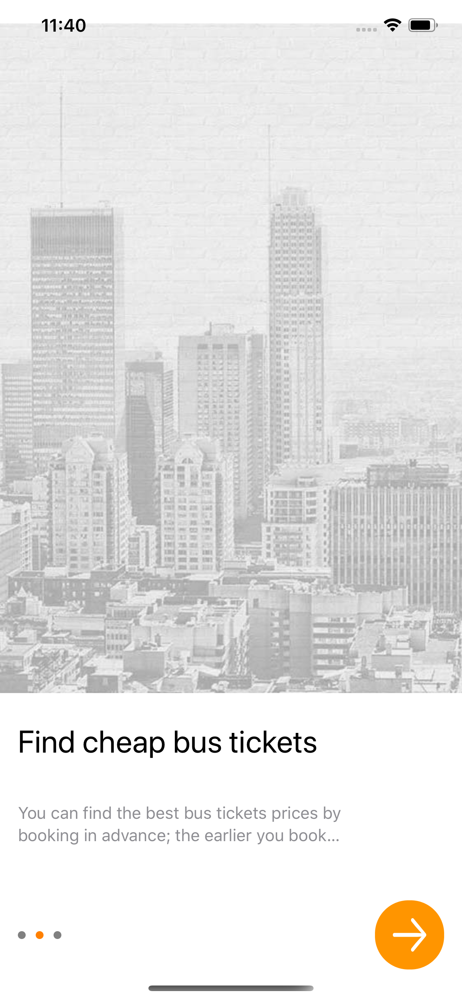
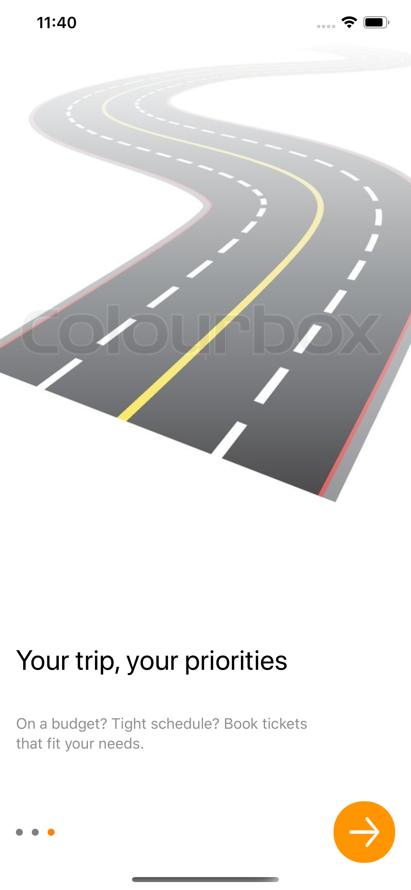
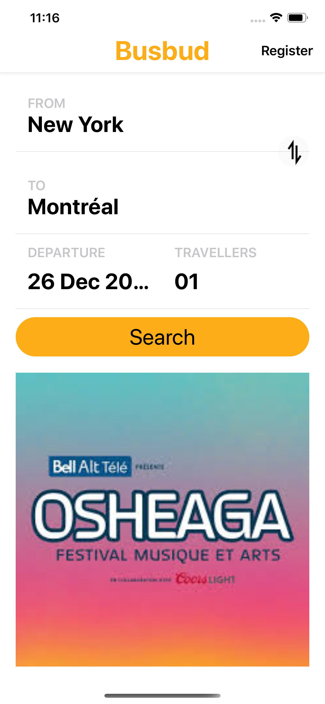
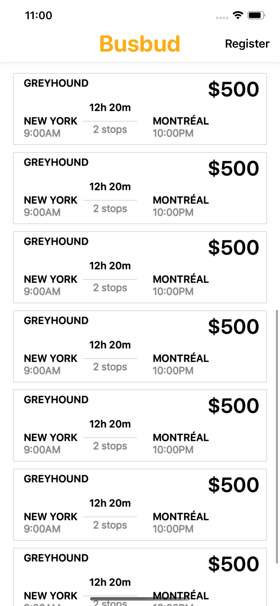

Hey! 

It will be hot this summer in Montreal with the [Osheaga festival](http://www.osheaga.com/)! 
Assuming we're not stuck with another wave of COVID-19, it will also be a rocking festival!
Your challenge is to build a promotional app that allows a traveler from NYC to find one-way departure schedules for the festival's opening weekend.

### Requirements

Write a native Busbud app that:

- Has a simple onboarding screen that will open the search
- Lists all the departures for a given origin city (**New York - geohash: dr5reg**) and a given destination city (**Montréal - geohash: f25dvk**) for a given day (**the 29th of July 2021**) for **1** adult. 
For each item, we want, at least, to see the **departure time**, the **arrival time**, the **location name** and the **price** (use `prices.total` of the `departure`).

### Non-functional requirements

- Challenge is submitted as pull request against this repo ([fork it](https://help.github.com/articles/fork-a-repo/) and [create a pull request](https://help.github.com/articles/creating-a-pull-request-from-a-fork/)).
- The repo should include 3 screenshots under the /screenshots folder to show the app usage.
- Change the README.md to explain your solution, the issues, the way you solved them...

### Supporting API

In order to complete this challenge, you will be making requests to `napi.busbud.com`, Busbud's production API.  
For all requests, you MUST provide the following HTTP headers:

Header | Value
--- | ---
Accept | `application/vnd.busbud+json; version=2; profile=https://schema.busbud.com/v2/`
X-Busbud-Token | The token provided in the challenge invitation email.

### Init results

To get departure results, search is initialized via the following endpoint:

`https://napi.busbud.com/x-departures/:origin/:destination/:outbound_date`

PATH PARAMS  

`origin` : Origin's geohash
`destination` : Destination's geohash
`outbound_date` : Outbound departure date

QUERY PARAMS:

`adult` : Number of adults
`child` : Number of children
`senior` : Number of seniors
`lang` : ISO 3166-1 alpha-2 language code
`currency` : ISO 4217 currency code

The response looks like:
```
{
  "origin_city_id": "375dd5879001acbd84a4683dedf9eed1",
  "destination_city_id": "375dd5879001acbd84a4683ded9c875b",
  "cities": [
    { City },
    { City }
  ],
  "locations": [
    { Location }
    { Location }
  ],
  "operators": [
    { Operator },
    { Operator }
  ],
  "departures": [
    { XDeparture },
    { XDeparture }
  ],
  "complete": false,
  "ttl": 900,
  "is_valid_route": true
}
```

Where a City is like:
```
   {
      "id": "375dd5879001acbd84a4683deda84183",
      "locale": "en",
      "region_id": 6417,
      "name": "New York",
      "lat": 40.71427,
      "lon": -74.00597,
      "geohash": "dr5reg",
      "timezone": "America/New_York",
      "image_url": "/images/promos/city-blocks/new-york.jpg",
      "legacy_url_form": "NewYork,NewYork,UnitedStates",
      "full_name": "New York, New York, United States",
      "region": {
        "id": 6417,
        "locale": "en",
        "country_code2": "US",
        "name": "New York",
        "country": {
          "code2": "US",
          "locale": "en",
          "code3": "USA",
          "name": "United States",
          "continent": "NA",
          "default_locale": "en",
          "default_currency": "USD",
          "population": 310232863
        }
      }
    }
```
Where a Location is like:
```
    {
      "id": 3970,
      "city_id": "375dd5879001acbd84a4683dedfb933e",
      "name": "Métro Bonaventure Bus Station",
      "address": [
        "997 Rue St-Antoine Ouest",
        "Montreal, QC H3C 1A6"
      ],
      "type": "transit_station",
      "lat": 45.4988273060484,
      "lon": -73.5644745826722,
      "geohash": "f25dvfzcz"
    }
```
Where an Operator is like:
```
    {
      "id": "bfc27cd544ca49c18d000f2bc00c58c0",
      "source_id": 155,
      "profile_id": 111,
      "name": "Greyhound",
      "url": null,
      "logo_url": "https://busbud-pubweb-assets-staging.global.ssl.fastly.net/images-service/operator-logos/greyhound.png?hash=1{&height,width}",
      "display_name": "Greyhound",
      "sellable": true,
      "fuzzy_prices": false,
      "sell_tickets_cutoff": {
        "hours": 1
      },
      "amenities": {
        "classes": {
          "Normal": {
            "display_name": "Economy",
            "wifi": true,
            "toilet": true,
            "ac": true,
            "food": false,
            "refreshment": false,
            "power_outlets": true,
            "tv": false,
            "bus_attendant": false,
            "leg_room": false
          },
          "Economy": {
            "display_name": "Economy",
            "wifi": true,
            "toilet": true,
            "ac": true,
            "food": false,
            "refreshment": false,
            "power_outlets": true,
            "tv": false,
            "bus_attendant": false,
            "leg_room": false
          }
        }
      },
      "source": "greyhound_us",
      "referral_deal": false,
      "display_url": null,
      "fraud_check": "iovation",
      "terms": {
        "refund": false,
        "exchange": true,
        "bag_allowed": true,
        "piece_of_id": false,
        "boarding_requirement": "printed_tkt",
        "extra_bag_policy": true,
        "use_new_ticket": false,
        "exchange_cutoff": 24,
        "nb_checked_bags": 1,
        "kg_by_bag": 25,
        "nb_carry_on": 1,
        "extra_bag_cost": 1500
      }
    }
```
And an XDeparture is :
```
    {
      "id": "7c5dd26a",
      "source_id": 155,
      "checkout_type": "new",
      "operator_id": "bfc27cd544ca49c18d000f2bc00c58c0",
      "origin_location_id": 1942,
      "destination_location_id": 1938,
      "class": "Economy",
      "class_name": "Economy",
      "amenities": {
        "display_name": "Economy",
        "wifi": true,
        "toilet": true,
        "ac": true,
        "food": false,
        "refreshment": false,
        "power_outlets": true,
        "tv": false,
        "bus_attendant": false,
        "leg_room": false
      },
      "available_seats": 55,
      "prices": {
        "total": 5200,
        "breakdown": {
          "base": 5200
        },
        "categories": {},
        "discounted": false
      },
      "ticket_types": [
        "print"
      ],
      "departure_timezone": "America/New_York",
      "arrival_timezone": "America/Montreal",
      "departure_time": "2016-01-14T00:01:00",
      "arrival_time": "2016-01-14T07:55:00"
    }
```

### Poll results

**While "complete" is false, you need to call** :

`https://napi.busbud.com/x-departures/:origin/:destination/:outbound_date/poll`

With ***all*** the same parameters that the previous endpoint, plus:

`index` : Index from which to return new departures

The response is:
```
{
  "departures": [
    { XDeparture },
    { XDeparture }
  ],
  "operators": [
    { Operator },
    { Operator }
  ],
  "complete": true,
  "ttl": 900
}
```

# Solution Steps

1. ## Questions

    1. Does application support all over world?
    2. What is target audience for application?
    3. Do we required scalable application? What extend? (Futures it will support airbuses bookings, hotel bookings etc)
    4. Does application support multiple languages?
    5. Do we want dynamic user interface?
    6. Does travel partner want separate application with change user interface only?
    7. What are the target audience for Osheaga festival only?

2. ## Research

    | Topic      | link |
    | ----------- | ----------- |
    | Osheaga | <https://www.osheaga.com/en> |
    | Osheaga | <https://en.wikipedia.org/wiki/Osheaga_Festival> |
    | Promotional app | <https://appsamurai.com/how-to-promote-travel-apps/> |
    | iOS app version uses | <https://gs.statcounter.com/ios-version-market-share/mobile/united-states-of-america>, <https://gs.statcounter.com/ios-version-market-share/mobile/united-states-of-america> |
    | Air Canada | <https://apps.apple.com/ca/app/air-canada/id326459697> |
    | EasyMyTrip | <https://apps.apple.com/tr/app/easemytrip-flight-booking-app/id1053030595> |
    | ClearTrip | <https://apps.apple.com/in/app/cleartrip/id531324961> |
    | Goibibo | <https://apps.apple.com/in/app/goibibo-flight-hotel-travel/id631927169> |
    | Trivago | <https://apps.apple.com/us/app/trivago-compare-hotel-prices/id376888389> |
    | Treebo | <https://apps.apple.com/in/app/treebo-hotel-booking-app/id1281202038> |
    | Expedia | <https://apps.apple.com/us/app/expedia-hotels-flights-car/id427916203> |
    | Redbus | <https://apps.apple.com/in/app/redbus-rpool/id733712604> |
    | FabHotels | <https://apps.apple.com/in/app/fabhotels-hotel-booking-app/id1434875063> |
    | MakeMyTrip | <https://apps.apple.com/in/app/makemytrip-flights-hotels/id530488359> |
    | Booking.com | <https://apps.apple.com/us/app/booking-com-hotels-travel/id367003839> |
    | Agoda | <https://apps.apple.com/in/app/agoda-best-travel-deals/id440676901> |
    | AirIndia | <https://apps.apple.com/us/app/air-india/id932302964> |
    | Greyhound | <https://apps.apple.com/us/app/greyhound-us/id931612822> |

    ## Referance User interface

    <p float="left">
      
      
      
      
      
    </p>  

3. ## Finalise

    | Title      | Description |
    | ----------- | ----------- |
    | Application flow | We can draw user flow diagram using draw.io |
    | Home screen | Search travels, offers, quick registeration popup only first time, click on offer auto search and display result |
    | Detail screen | After search, we will display result on same page(Home page) so user can search again |
    | Registration screen | Quick registeration popup we can trigger before complete booking |
    | Onboarding screen | Show quick view of app and benefits |

4. ## Applications configuration

   | xcode version | Language      | minimum version | Architecture |
   | ----------- | ----------- | ----------- | ----------- |
    | 11.6 | Swift | 13.0 | Main application - VIPER, Services -  Facade patterns |

5. ## Create services frameworks

    1. Structure
    2. Service integration
    3. Testcases
    4. Export framework script

6. ## Application

    1. Structure
    2. Home screen
        1. Search
        2. Promotion
        3. Service integration
        4. Testcases
        5. Automation
    3. Details screen
        1. Display list
        2. Create cell
        3. Testcases
        4. Automation
    4. Registration screen
        1. Ask email or phone
        2. Testcases
        3. Automation
    5. Onboarding screen
        1. Add pager view

7. ## Faced issues

    | Issue      | Solution |
    | ----------- | ----------- |
    | View README.md file without commit | <https://code.visualstudio.com/docs/languages/markdown> |
    | Build framework | Solved script issue |
    | Localize string not dispalay | Due to miss localize table name |
    | Facing many issue while develop UI using SwiftUI | did R&D and try to sovled problem |

8. ## Final Screenshots

<p float="left">
      
      
      
      
      
      
    </p>

9. ## Run application

    1. Open BBServices project and build framework
    2. Open BusBud project and run application

10. ## Next steps

    1. To fix onbarding page top spacing and bottom spacing
    2. Add comments on code
    3. Required to add testcases for each components
    4. Required to add animation between two screen and search and results
    5. Maintain properly localize string
    6. Search with city, date and passanger screen need to be add
