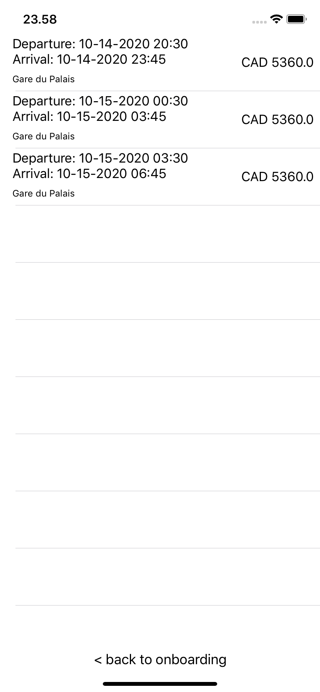

### Explanation of the approach
- The approach was to make architect the app in a way that it is extendable, components that are loosely coupled and easily testable. 
- VIPER architecture pattern is used to achieve loosely coupled objects. 
- Each VIPER module has a `listener` parameter which is based on the 
- Protocol oriented programming approach is used as much as possible to make it easy to mock different components while testing. 
- Dependency injects are used wherever appropriate.
- Third-party dependencies are used to the minimum, the only two included are just to save time, which can be replaced easily if required i.e. `SearchRoutesDefaultService` can be replaced with a new class where `alamofire` dependency is not used.    

### The Issues
No technical challenge was faced as such. 

1. The API response was missing for the date mentioned in the challenge. Some of the Unit Tests were written while I was not able to get API response to verify the models. 
2. The use of Index was a bit confusing with the pagination concept in the challenge but on clarification, it is clear now. It is still a untested logic as API is not returning response where App needs to make more API calls. 

### Suggested Improvements

The goal was to finish the challenge in 8-9 hours. So a few compromises were made. Here are the improvements which can be made to the app.

* Overall UI/UX of the app. 

* A Search Screen and be created to take the input from the user, which is not created to save time and focus more on the architecture stuff. 

* Dates can be shown on UI in a more human-readable way and in a localized way. For example, the dates of departures or arrival from Monteral could be in Monteral time while presenting on the UI (bascially noty taking into consideration the current device timezone). The main theme of the assignment was to show the architecture of the app, not proper UI/UX.  

* Proper error handling (Network or other error types) and loading states (i.e. loadingh, empty)  are missing.  

* Unit Test coverage can ve increased and [Mockolo ](https://github.com/uber/mockolo) can be used to generate mocks for easy testing.  

* Proper localization of the app content as **Busbud** will be a localized app. 
* Proper frameworks can be created to further modularize the project i.e. `busbudNetwork` framework. 

### How to run the project 
`pod install` on the project root folder and open the new `.xcworkspace` file to run the project in `xcode`

### App Flow

| Onboarding Screen | Search Results Screen | 
| :---:| :---:|
|  |  |