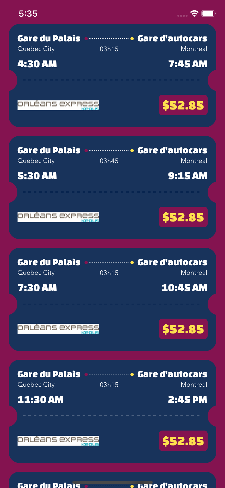

Hello! 

I have completed this challenge using `SwiftUI` and `Combine`.
Still a new way of coding and very early technics and patterns around `SwiftUI`, but a very interesting new way of creating apps. Made MVC, MVVM outdated and a bit unrelevant. Very exciting to see where the community will be headed in the next year with it.

### Installation

You will need Xcode 12 to be able to compile the project, deployement target is 14.0. The choice was based on wanted to use:
```
struct OsheagaGoApp: App {
    var body: some Scene {
        WindowGroup {
            OnBoardingView()
        }
    }
}
``` 
Instead of the AppDelegate + SceneDelegate.
The code can easily be changed to an ios 13.x compatibility.

You will need [cocoapods-keys](https://github.com/orta/cocoapods-keys) and will need to run `gem install cocoapods-keys`.
I use this so we can store the API key into your own keychain and access it without having to commit in clear the key into github.

Running `bundle exec pod install` should install you pods and should prompt you for the `BusbudToken` key to be inserted.

Would need Ruby and Bundler installed.

### Notes

- Probably because of uncertainties of next year, but I couldn't use **the 29th of July 2021** as the search date, results were empty, so I picked randomly **the 25th of November 2020**.
- I have worked on the polling challenge but couldn't find a suitable date that required pagination to test my work.

### Challenges

The only challenges was around the polling as I left it for the end and stepped into the reduced amount of information contained into the response.

### Solution

I should have tackle this problem at the beginning so I could have came out with a better solution. But I manage to fit a solution by passing `cities` and `locations` from the previous response stored into a variable so the new departures set can be treated. Depending on the result wanted we could simply aggregate the new departures to the previous one, to then have a complete list of departures available. I opt for a simple pagination of new content going only forward in the indexes.
At a bigger scale of actually making a real app, the solution could be better.

### Tests

I did few tests around models and data formatting. Wanted to make some tests around the `RestClient` and `DepartureSearchService` but needed much more work on mocking Combine using like [Entwine](https://github.com/tcldr/Entwine), this would have require much more time to achieve properly.

I integrated a pod `SnapshotTesting` that I think is very useful to catch layout issues on various amount of devices and color schemes. But also in my experience manage to test like localisation missing strings or formatting issues. Decided to comment out the code to avoid generating a lot of pngs but mostly to show the result if you want to.

### Project

I went for a separation of the UI, Service into the main app bundle `OsheagaGo` and put everything else like the client, models and utilities into `OsheagaKit`. I take this approach as a good practice and it allows the possibility of creating like white label app in the future.

### UI

Didn't want to over do it but still wanted to make it look nice, so I took some inspiration on dribbble.com. For the loading view i downloaded a free lottie animation and changed some colors in it to fit the color scheme.
I made sure the app was using the light and dark mode into consideration, this is for me a very important part when starting a new app as doing it later brings a heavy refactor.
And SwiftUI allows an ease of doing such a thing!

### Screenshots

| Welcome | Loading | Results | Dark |
| ------- | ------- | ------- | ---- |
|  |  |  |  |